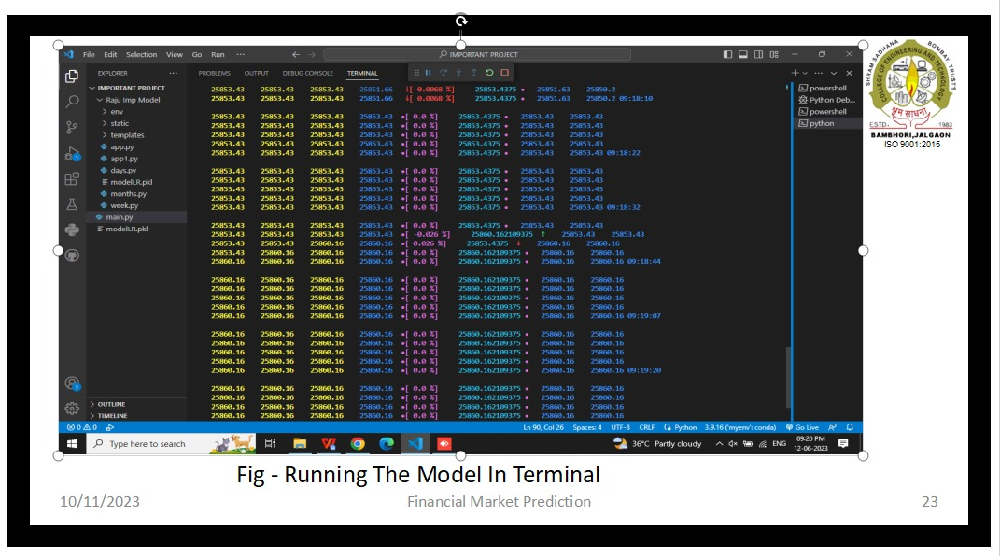
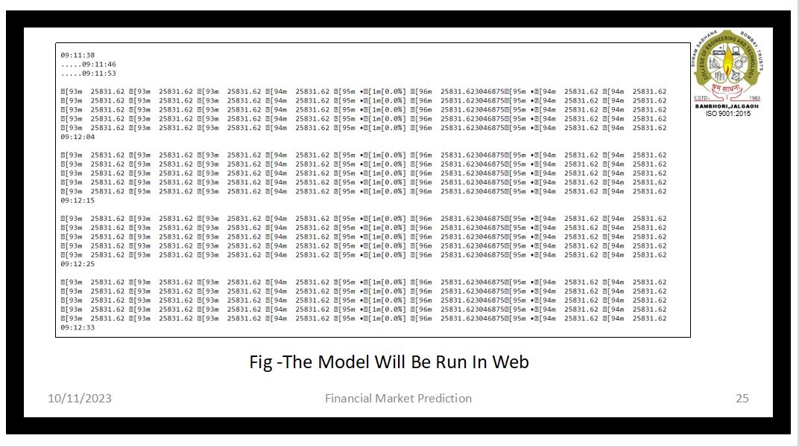
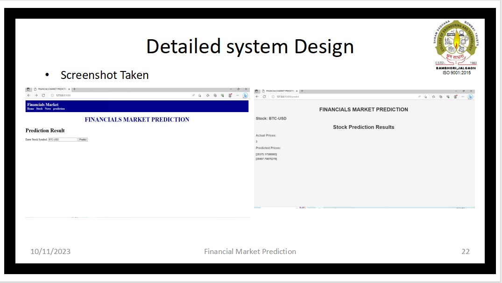
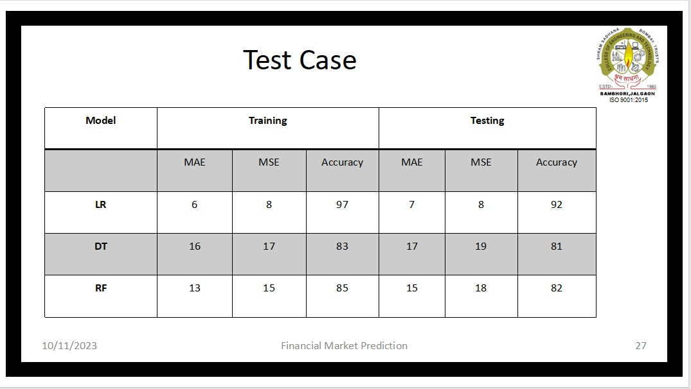

# Financial_Market_Prediction
"Financial Market Prediction" is the process of using data and analytics to forecast future movements and trends in financial markets.

The proposed market prediction in the market  aims to develop a robust and
accurate prediction model that can forecast the movements of currency pairs.

### View real-time data stream and financial market prediction:

Access historical data and generate customized reports.
Perform data analysis and visualization.
Utilize prediction tools and algorithms.
Collaborate with other users or teams within the system.

### Time Feasibility -

1. Project Planning and Scheduling
2. Contingency Planning
3. User Management

### Operational Feasibility -

1. Resource Availability
2. Data Accessibility
3. Data Management
4 .Technical Infrastructure

[Dawanlode](https://github.com/ashuupatil07/Financial_Market_Prediction/edit/main/README.md)

A feaibility study is a detailed analysis that considers all of the its sub parts like  technical feasibility, time feaibility and operational feaibility.

# Hardware Requirement -  
Processor               :     Dual-core or above
RAM                     :     Minimum 4GB or more.
Hard Disk               :     Minimum 4 GB of space
Input Device            :     Keyboard
Output Device           :     Screens of Monitor or a Laptop

https://github.com/rjghongade/RAM_AntiVirus/assets/105046011/613324fd-8d69-475e-b1e3-97c0704ceab4

